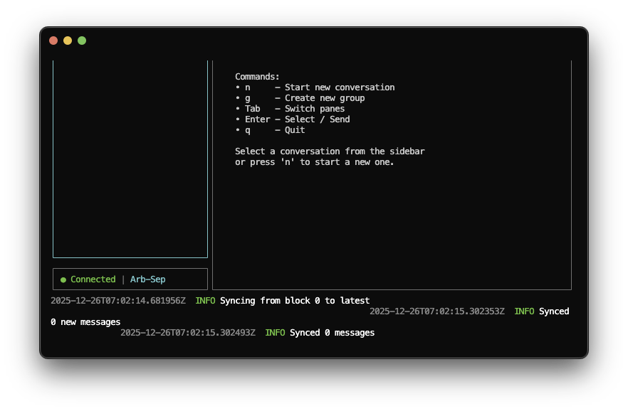

# daggerChat

A blockchain-based secure chat application with end-to-end encryption and a terminal UI. Messages are encrypted locally and stored on the Ethereum blockchain (Arbitrum L2), ensuring privacy and immutability.


## Table of Contents

- [Screenshots](#screenshots)
- [Features](#features)
- [Installation](#installation)
- [Configuration](#configuration)
- [Usage](#usage)
- [Keyboard Shortcuts](#keyboard-shortcuts)
- [Smart Contract](#smart-contract)
- [Security](#security)
- [Project Structure](#project-structure)
- [Contributing](#contributing)
- [Acknowledgments](#acknowledgments)
- [Author](#author)

## Screenshots



## Features

- **End-to-end encryption** - X25519 key exchange + XChaCha20-Poly1305 encryption
- **Decentralized storage** - Messages stored on Arbitrum (Ethereum L2)
- **Wallet authentication** - Login with your Ethereum wallet
- **Direct messaging** - Private 1-on-1 encrypted chats
- **Group chats** - Create groups with shared encryption keys
- **Terminal UI** - Fast, keyboard-driven interface
- **Offline support** - Queue messages when offline, sync when connected
- **Local caching** - SQLite database for fast message access

## Installation

### Prerequisites

- Rust 1.75 or later
- An Ethereum wallet with some ETH on Arbitrum (for gas fees)
- An RPC endpoint (Alchemy, Infura, or public RPC)

### Build from source

```bash
# Clone the repository
git clone https://github.com/mantreshkhurana/daggerChat.git
cd daggerChat

# Build the project
cargo build --release

# The binary will be at ./target/release/dagger-chat
```

## Configuration

Create a `.env` file in the project root (or copy from `.env.example`):

```bash
# Arbitrum RPC endpoint
RPC_URL=https://arb-mainnet.g.alchemy.com/v2/YOUR_API_KEY

# Your wallet private key (without 0x prefix)
# WARNING: Never commit your actual private key!
PRIVATE_KEY=your_private_key_here

# DaggerChat contract address (after deployment)
CONTRACT_ADDRESS=0x...

# Log level
LOG_LEVEL=info
```

## Usage

```bash
# Run with .env configuration
./target/release/dagger-chat

# Or specify options directly
./target/release/dagger-chat --rpc-url https://... --wallet 0x...

# Enable debug logging
./target/release/dagger-chat --debug
```

### Keyboard Shortcuts

| Key | Action |
|-----|--------|
| `Tab` | Switch between sidebar and chat |
| `j/k` or `↑/↓` | Navigate conversations/messages |
| `Enter` | Select conversation / Send message |
| `n` | New conversation |
| `g` | Create group |
| `Ctrl+W` | Wallet info |
| `Ctrl+R` | Force sync |
| `Esc` | Go back / Cancel |
| `q` or `Ctrl+Q` | Quit |

## Smart Contract

The `DaggerChat.sol` contract is deployed on Arbitrum and provides:

- User registration with X25519 public keys
- Encrypted message storage
- Batch message sending (gas optimization)
- Group chat management
- Event-based message indexing

### Deploy the contract

```bash
# Using Foundry
forge create --rpc-url $RPC_URL \
  --private-key $PRIVATE_KEY \
  contracts/DaggerChat.sol:DaggerChat

# Or using Hardhat/Remix
```

## Security

- **Private keys**: Never stored; only used for signing
- **Message encryption**: XChaCha20-Poly1305 with per-message nonces
- **Key exchange**: X25519 ECDH for DMs, shared symmetric keys for groups
- **Local storage**: Encryption keys protected with password-derived keys

## Project Structure

```txt
daggerChat/
├── Cargo.toml              # Rust dependencies
├── contracts/
│   └── DaggerChat.sol      # Solidity smart contract
├── migrations/
│   └── 001_initial.sql     # SQLite schema
└── src/
    ├── main.rs             # Entry point
    ├── app.rs              # Application state
    ├── config.rs           # Configuration
    ├── errors.rs           # Error types
    ├── blockchain/         # Ethereum integration
    ├── chat/               # Chat logic
    ├── crypto/             # Encryption
    ├── storage/            # Local SQLite
    └── tui/                # Terminal UI
```

## Contributing

Contributions are welcome! Please feel free to submit a Pull Request.

## License

MIT License - see [LICENSE](LICENSE) for details.

## Acknowledgments

- [Alloy](https://alloy.rs/) - Ethereum SDK for Rust
- [ratatui](https://ratatui.rs/) - Terminal UI framework
- [RustCrypto](https://github.com/RustCrypto) - Cryptography libraries

## Author

- [**Mantresh Khurana**](https://github.com/mantreshkhurana)
